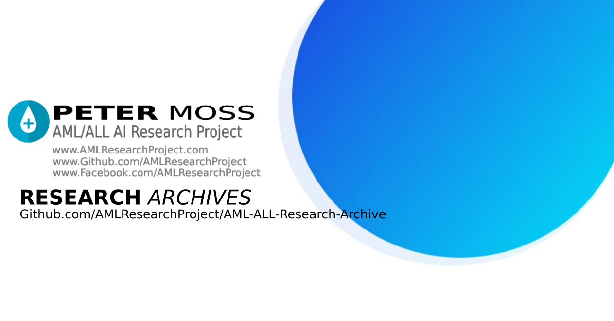
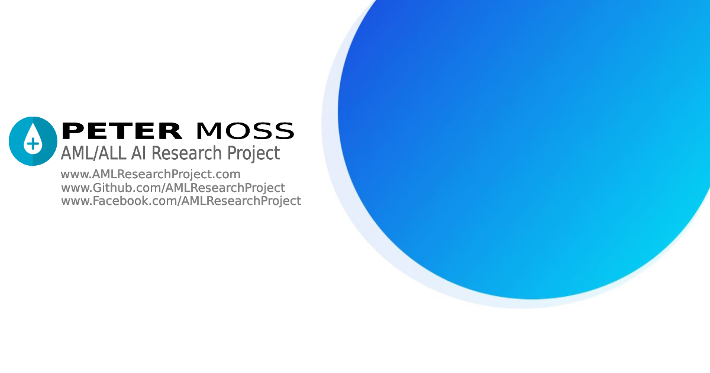
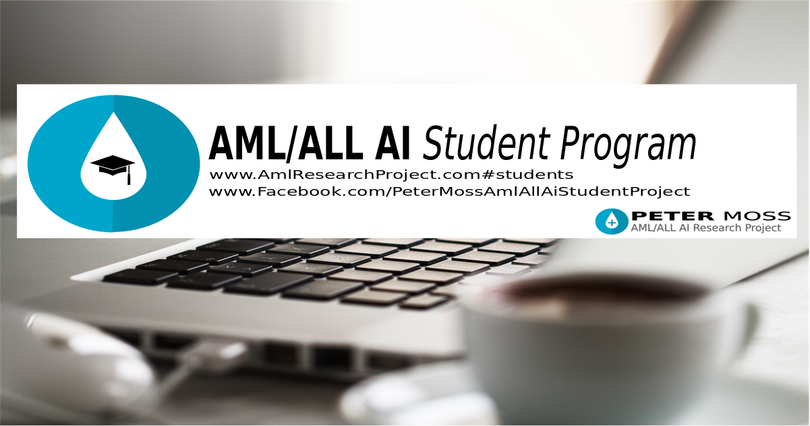

# Peter Moss Acute Myeloid/Lymphoblastic Leukemia AI Research Project Archive

The Peter Moss Acute Myeloid/Lymphoblastic Leukemia AI Research Project Archive documents public information, datasets, code and papers related to Acute Myeloid Leukemia and Acute Lymphoblastic Leukemia that we come across through research and development.

# Project Research

Links to all public research papers, code, tutorials and datasets that we come across during the R&D of this project will be made available via the Research Archive as well as posts to the project Facebook page. We will also share project documentation for building and using our own networks as well as links to latest code releases on the project Github.

## Research Archives

Our research archives will contain all public information we are able to find that is related to Acute Myeloid/Lymphoblastic Leukemia if we feel the information is relevant. We also greatly appreciate community members that have had experiences with AML/ALL sharing their experience and advice to the community.

If you are not a dev/know how to use Github please email and it will be verified and uploaded on your behalf.

The primary research archives are as follows:

- [Peter Moss Acute Myeloid/Lymphoblastic Leukemia Project Research Papers Archive](https://github.com/AMLResearchProject/AML-ALL-Research-Archive/blob/master/Papers.md "Peter Moss Acute Myeloid/Lymphoblastic Leukemia Project Research Papers Archive")

- [Peter Moss Acute Myeloid/Lymphoblastic Leukemia Project Research Leukemia Information Archive](https://github.com/AMLResearchProject/AML-ALL-Research-Archive/blob/master/Leukemia.md "Peter Moss Acute Myeloid/Lymphoblastic Leukemia Project Research Leukemia Information Archive")

- [Peter Moss Acute Myeloid/Lymphoblastic Leukemia Project Research Datasets Archive](https://github.com/AMLResearchProject/AML-ALL-Research-Archive/blob/master/Datasets.md "Peter Moss Acute Myeloid/Lymphoblastic Leukemia Project Research Datasets Archive")

- [Peter Moss Acute Myeloid/Lymphoblastic Leukemia Project Research Drugs Archive](https://github.com/AMLResearchProject/AML-ALL-Research-Archive/blob/master/Drugs.md "Peter Moss Acute Myeloid/Lymphoblastic Leukemia Project Research Drugs Archive")

- [Peter Moss Acute Myeloid/Lymphoblastic Leukemia Project Research Software Archive](https://github.com/AMLResearchProject/AML-ALL-Research-Archive/blob/master/Software.md "Peter Moss Acute Myeloid/Lymphoblastic Leukemia Project Research Software Archive")

- [Peter Moss Acute Myeloid/Lymphoblastic Leukemia Project Research Code Archive](https://github.com/AMLResearchProject/AML-ALL-Research-Archive/blob/master/Code.md "Peter Moss Acute Myeloid/Lymphoblastic Leukemia Project Research Code Archive")

- [Acute Myeloid/Lymphoblastic Leukemia Related Websites Archive](https://github.com/AMLResearchProject/blob/master/Websites "Acute Myeloid/Lymphoblastic Leukemia Related Websites Archive")

- [Acute Myeloid/Lymphoblastic Leukemia Related Facebook Facebook Page, Group & Fundraisers](https://github.com/AMLResearchProject/blob/master/Facebook "Acute Myeloid/Lymphoblastic Leukemia Related Facebook Page, Group & Fundraisers Archive")

# About The Peter Moss Acute Myeloid/Lymphoblastic Leukemia AI Research Project

The Peter Moss Acute Myeloid / Lymphoblastic Leukemia AI Research Project is an open source project with the goals of leveraging Artificial Intelligence to help detect AML/ALL and discover potential candidates for drugs to help combat the diseases. The project is in memory of Peter Edward Moss who lost his battle with Acute Myeloid Leukemia in August 2019.

The project is being coordinated by a group of volunteers with experience in computer vision / natural language processing, Leukemia research, Biochemistry, Molecular Biophysics, Immunology and Bioinformation.

The purpose of the project is to share public information related to AML/ALL, as well as open source projects aimed at early dectection with convolutional neural networks, using natural language understanding for AML/ALL chatbots, and R&D for discovering potential candidates for drugs for AML/ALL.

## Project Team

The official team is currently made up of:

- [Adam Milton-Barker](https://github.com/orgs/AMLResearchProject/people/AdamMiltonBarker "Adam Milton-Barker") - Bigfinite IoT Network Engineer & Intel Software Innovator

- [Ho Leung Ng](https://github.com/orgs/AMLResearchProject/people/holeung "Ho  Leung Ng") - Kansas State University, Dept. Biochemistry & Molecular Biophysics

- [Amita Kapoor](https://github.com/orgs/AMLResearchProject/people/amita-kapoor "Amita Kapoor") - Associate Professor @ Delhi University, New Dehli, India

- [Estela Cabezas](https://www.facebook.com/Esteeelaa "Estela Cabezas") - Degree in Biotechnology @ Universitat de Vic, Catalunya, Spain

- [Salvatore Raieli​](https://github.com/orgs/AMLResearchProject/people/SalvatoreRa "Salvatore Raieli​") - Salvatore Raieli attended a Biotechnology degree at a university in Paris for his PhD.

- [Rishabh Banga](https://github.com/orgs/AMLResearchProject/people/rishabhbanga "Rishabh Banga")​ - Software Dev @ Seamens. Awarded 1st by Prime Minister of Netherlands in a Hackathon.

## Project Structure

The project is split up into multiple smaller projects. The current structure includes:

- [Peter Moss Acute Myeloid/Lymphoblastic Leukemia Student Program](https://github.com/AMLResearchProject/AML-ALL-AI-Student-Program "Peter Moss Acute Myeloid/Lymphoblastic Leukemia Student Program")

- [Peter Moss Acute Myeloid/Lymphoblastic Leukemia Project Research Archive](https://github.com/AMLResearchProject/AML-ALL-Research-Archive "Peter Moss Acute Myeloid/Lymphoblastic Leukemia Project Research Archive")

- [Peter Moss Acute Myeloid/Lymphoblastic Leukemia Project Classifiers](https://github.com/AMLResearchProject/AML-ALL-Classifiers "Peter Moss Acute Myeloid/Lymphoblastic Leukemia Project Classifiers")

- [Peter Moss Acute Myeloid/Lymphoblastic Leukemia Project Detection System](https://github.com/AMLResearchProject/AML-ALL-Detection-System "Peter Moss Acute Myeloid/Lymphoblastic Leukemia Project Detection System")

- [Peter Moss Acute Myeloid/Lymphoblastic Leukemia Project Drug Discovery](https://github.com/AMLResearchProject/AML-ALL-Drug-Discovery "Peter Moss Acute Myeloid/Lymphoblastic Leukemia Project Drug Discovery")

# The Peter Moss Acute Myeloid / Lymphoblastic Leukemia AI Student Program

The Peter Moss Aml/All AI Student Program​ provides college & university students with real world projects & experience in working with AI for medical purposes, helping further their education and understanding of real world medical AI systems.

The Student Program is headed by Peter Moss Aml/All AI Research Project​ team members [Ho Leung Ng](https://github.com/holeung "Ho  Leung Ng")​ - Dept. Biochemistry & Molecular Biophysics @ Kansas State University, and [Amita Kapoor](https://github.com/amita-kapoor "Amita Kapoor")​ - Associate Professor @ Delhi University.

If you would like to join the Student Developer Program please answer the questions on the [Private AML/ALL AI Student Program Chat Group​](https://www.facebook.com/groups/AmlAllPrivateStudentAiProgram "Private AML/ALL AI Student Program Chat Group​").

# Professional Volunteers

If you would like to volunteer to the research project or student program as a professional, please use the contact form on our website and select **Professional Volunteer**.

# Community Driven

The project was initially created with the hope other developers and people in the medical industry may find the software and tutorials useful, and may contribute back to the Github community helping improve the project. Feel free to submit pull requests with your suggested edits / bug fixes / additions to the related repositories on Github.

# Contributing

We welcome contributions of the project. Please read [CONTRIBUTING.md](https://github.com/AMLResearchProject/AML-ALL-Research-Archive/blob/master/CONTRIBUTING.md "CONTRIBUTING.md") for details on our code of conduct, and the process for submitting pull requests.

# Versioning

We use SemVer for versioning. For the versions available, see [Releases](https://github.com/AMLResearchProject/AML-ALL-Research-Archive/releases "Releases").

# License

This project is licensed under the **MIT License** - see the [LICENSE](https://github.com/AMLResearchProject/AML-ALL-Research-Archive/blob/master/LICENSE "LICENSE") file for details.

# Bugs/Issues

We use the [repo issues](https://github.com/AMLResearchProject/AML-ALL-Research-Archive/issues "repo issues") to track bugs and general requests related to using this project.
